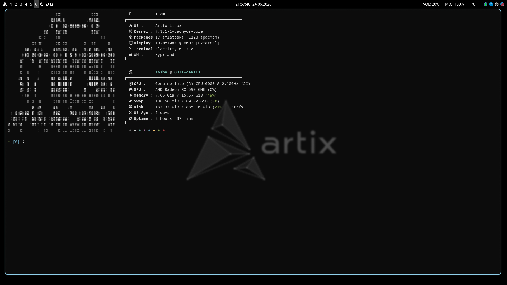

# 🚀 My Arch/Artix Dots

Минималистичный и тёмный конфиг для **Hyprland** на базе Arch/Artix Linux.



## 📦 Особенности
* **Гибкий установщик**: Скрипт сам проверит зависимости и установит всё необходимое.
* **Автоматизация**: Установка `yay`, настройка конфигов и автостарт скриптов (Waybar, Infinite Desktop, Wallpaper).
* **Оптимизация**: Использование `swaybg` для обоев и `alacritty` с прозрачностью из коробки.

## 🛠 Установка

1. Склонируй репозиторий:
   ```bash
   git clone [[https://github.com/paramo0/repo.git](https://github.com/paramo0/repo.git)](https://github.com/param0/sasha_paramonov-dots.git) ~/dots
   cd ~/dots
